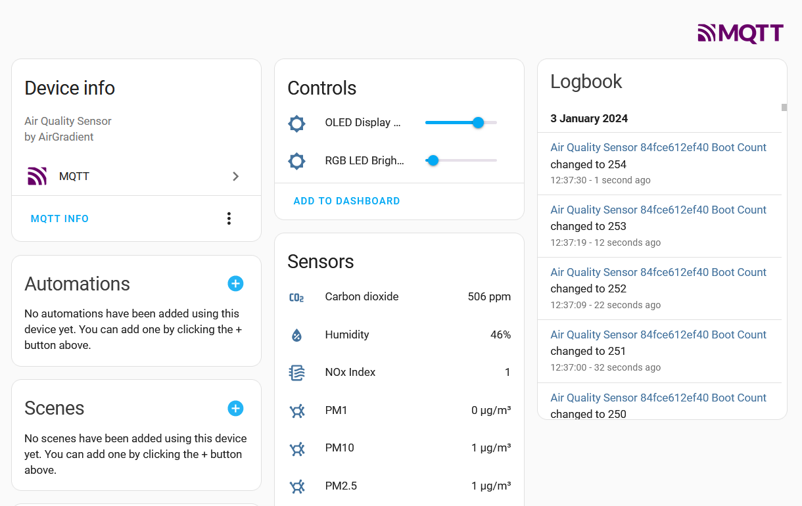

# airgradient - cloud-free

This repository contains a drop-in cloud replacement for airgradient sensors that takes the data and publishes it to MQTT
providing Home Assistant autodiscovery metadata. The only to-do being to redirect the DNS.

It provides the experience I _thought_ I would be getting when I bought these sensors that were marketed to me as being
"the open solution" that you'd want to get because things just work ootb cloud-free. Well, that wasn't the case. But now it is.

It further contains custom firmwares that implement additional functionality in combination with this mock cloud. 
That functionality being:
- The ability to reset wifi credentials (at all)
- The ability to change the brightness of the V9 LED Bar and OLED Display (for not using it as a night light)

Conceivably, additional functionality such as e.g. triggering the manual CO2 Sensor calibration could be added in the future.

## airgradient2mqtt

A simple mock cloud implementation that takes the data and pushes it to mqtt.
Provides Home Assistant Autodiscovery. 

It should work with the stock firmware, but if you want to send commands to the sensor, you need these customized ones.

See [./airgradient2mqtt/Readme.md](./airgradient2mqtt/Readme.md) for more information

## Firmware

based on https://github.com/airgradienthq/arduino with input from https://github.com/lschloetterer/airgradient-one-v9

Changes:
- The cloud can send commands to the sensor on each data push
  - Reboot
  - Reset WiFi
  - Set RGB Strip brightness (for the V9)
  - Set OLED brightness (for the V9)
- APIROOT URL set to `airgradient.internal`
- (V9 Only) RGB strip shows gradual changes in CO2 value by calculating hue dynamically